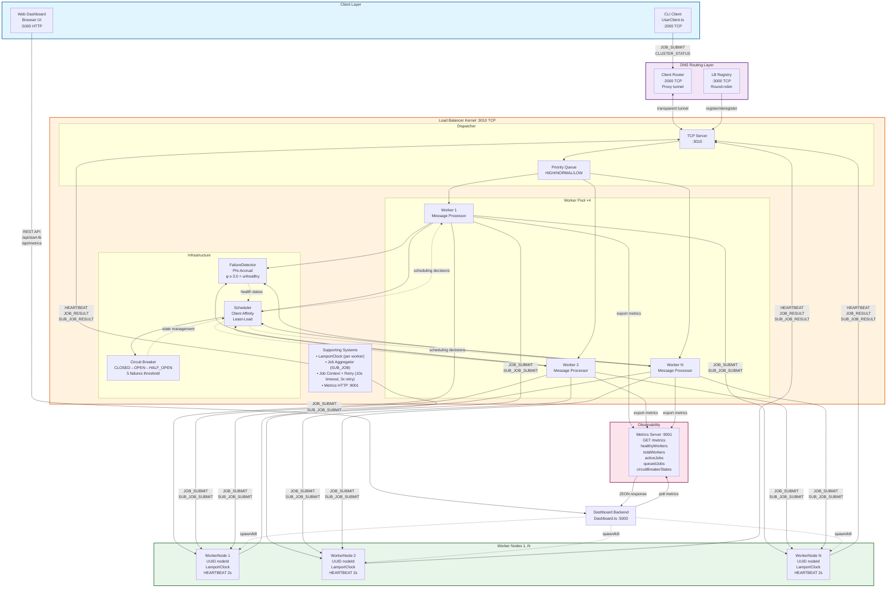

# ClusterOS — Project Structure & System Design

## Overview

ClusterOS is a distributed computing cluster built entirely in TypeScript/Node.js. It implements a multi-tier architecture with a DNS routing layer, load balancer with an internal worker pool, dynamic worker nodes, a browser-based dashboard, and a CLI client. The system uses Lamport logical clocks for causal ordering, Phi-accrual failure detection, client-affinity scheduling, and a circuit breaker pattern for fault tolerance.

---
## Project Structure

```
cluster-os/
├── src/
│   ├── kernel/           LoadBalancer, Scheduler, Lamport Clock
│   ├── worker/           Worker Node implementation
│   ├── network/          DNS Router implementation
│   ├── dashboard/        Web UI and backend server
│   └── middleware/       Failure detection
├── tests/                Automated tests
├── package.json          Project dependencies
└── README.md            This file
```

## Key Concepts Demonstrated

### Load Balancer as Kernel
The load balancer acts as the central "kernel" of the cluster. All jobs go through it, and it decides which worker gets each job. This abstraction makes the cluster look like a single machine to clients.

### Failure Detection
The system continuously monitors worker health through heartbeat messages. If a worker stops responding, the system automatically stops sending it jobs. When the worker recovers, the system puts it back to work.

### Circuit Breaker Pattern
Each worker has a state:
- CLOSED: Healthy, accepting jobs
- OPEN: Failed, rejecting jobs
- HALF_OPEN: Testing recovery with limited jobs

### Job Aggregation
Large jobs are divided into smaller tasks that workers process in parallel. Results are collected and returned in the correct order.

### Lamport Clock
Every message in the system gets a logical timestamp. This ensures all events can be ordered correctly, even without synchronized clocks. This is essential for debugging and ensuring correct ordering in distributed processing.

## System Architecture Diagram



---

## High-Level System Design

ClusterOS follows a **4-layer architecture** optimized for distributed job processing:

### **Layer 1: Client Layer**
- **CLI Client** (`UserClient.ts`): Command-line interface for submitting jobs, checking status
- **Web Dashboard**: Browser-based UI for visualization, metrics monitoring, and cluster control
- Both clients communicate through the DNS Router for transparent load balancing

### **Layer 2: DNS Routing Layer**
- **Client Router** (port 2000): Transparent TCP proxy that tunnels client requests to available Load Balancers
- **LB Registry** (port 3000): Accepts Load Balancer registrations; maintains round-robin selector
- Enables **multi-LB deployments** where clients transparently failover across registered load balancers
- 60-second heartbeat timeout for stale LB detection

### **Layer 3: Load Balancer Kernel** (Port 3010)
The heart of ClusterOS—orchestrates all job distribution and worker coordination:

**Dispatcher (Priority Queue)**
- Receives messages from clients and workers via TCP port 3010
- Maintains priority queue: HIGH → NORMAL → LOW
- Message types: JOB_SUBMIT, HEARTBEAT, JOB_RESULT, SUB_JOB_SUBMIT, etc.

**Worker Pool (×4 processors)**
- 4 message processing threads run in parallel
- Each processes dequeued messages from the priority queue
- Routes jobs to healthy worker nodes via Scheduler
- Handles job aggregation for array payloads (splits into SUB_JOB_SUBMIT)
- Tracks job context, retries, timeouts (10s default, 3 retries max)

**Infrastructure Layer**
1. **FailureDetector** (Phi-Accrual): Continuously monitors worker health via heartbeat intervals; marks nodes unhealthy when φ ≥ 3.0
2. **Scheduler**: Routes jobs with **client affinity** (sticky sessions); performs least-load selection among healthy nodes; checks circuit breaker states
3. **Circuit Breaker**: Per-worker state machine (CLOSED → OPEN → HALF_OPEN) with configurable thresholds (5 failures, 30s timeout, 2 success probes)

**Supporting Systems**
- **LamportClock**: Logical timestamps for causal message ordering (each worker maintains one)
- **Job Aggregator**: Reassembles SUB_JOB results back into full arrays in correct order
- **Metrics HTTP** (port 9001): Exposes `/metrics` endpoint with live cluster state (healthy workers, queued jobs, circuit breaker states)

### **Layer 4: Worker Nodes** (1 … N)
- Each Worker Node connects to LB port 3010
- Maintains UUID nodeId for persistent identification (not ephemeral TCP IDs)
- Sends HEARTBEAT every 2 seconds with active job count
- Processes JOB_SUBMIT and SUB_JOB_SUBMIT messages
- Returns results via JOB_RESULT or SUB_JOB_RESULT
- Includes LamportClock for message ordering

### **Layer 5: Observability**
- **Dashboard Backend** (port 5000): HTTP server that polls metrics, serves UI, spawns/kills worker processes
- **Metrics Server** (port 9001): Aggregates health data, circuit breaker states, queue depth
- Real-time visualization of system state in browser dashboard

---

## Data Flow: Job Submission to Result

```
1. CLI User submits job → UserClient connects to DNS :2000
2. DNS Router routes through transparent tunnel → LoadBalancer :3010
3. LoadBalancer Dispatcher enqueues message in priority queue
4. Worker pool dequeues → processes JOB_SUBMIT message
5. Scheduler.getNextNode() queries FailureDetector + checks CircuitBreaker
6. If array payload: split into N SUB_JOB_SUBMIT; send to N workers
   If scalar: send single JOB_SUBMIT to one worker
7. Worker Node receives, processes, returns JOB_RESULT (or SUB_JOB_RESULT)
8. LoadBalancer Worker receives result:
   - If JOB_RESULT: forward to client, mark success in CircuitBreaker
   - If SUB_JOB_RESULT: aggregate with others; when all chunks done, send final JOB_RESULT
   - If timeout: recordWorkerFailure() → maybe transition CLOSED→OPEN; retry on different worker
9. Result sent back through DNS tunnel to original client
10. CLI displays result or Dashboard shows in results panel
```

---

## Component Reference

| Layer | Component | Port(s) | Role |
|---|---|---|---|
| Client | `UserClient` | connects to :2000 | CLI — `submit`, `status`, `help`, `exit` |
| Client | `Browser` | connects to :5000 | Web UI consuming Dashboard REST API |
| Network | `DNSRouter` | :2000 (client), :3000 (LB reg) | Transparent TCP proxy tunnel to LBs; round-robin across registered LBs |
| Compute | `LoadBalancer` | :3010 (TCP), :9001 (HTTP metrics) | Priority-queue `Dispatcher` + 4 internal `Worker` message processors |
| Scheduling | `Scheduler` | — | Client-affinity sticky sessions + circuit-breaker-aware least-loaded node selection |
| Health | `FailureDetector` | — | Phi-accrual algorithm; tracks heartbeat interval history; φ ≥ 3.0 = unhealthy |
| Resilience | `CircuitBreaker` | — | CLOSED → OPEN (5 failures) → HALF_OPEN (30 s timeout) → CLOSED (2 successful probes) |
| Fault-tolerance | Job retry | — | 10 s job timeout, up to 3 retries on different workers |
| Fan-out | Aggregation | — | Array payloads split into `SUB_JOB_SUBMIT` chunks across all healthy workers, reassembled in order |
| Observability | Metrics HTTP | :9001 | `GET /metrics` → JSON: `healthyWorkers`, `totalWorkers`, `activeJobs`, `queuedJobs`, `circuitBreakerStates` |
| Observability | `Dashboard` | :5000 | Polls `:9001`, submits jobs via TCP `:3010`, can spawn/kill worker processes |
| Clocks | `LamportClock` | — | Each LB worker processor + each WorkerNode maintains a logical clock for causal ordering of messages |

---

## Key Port Map

| Service | Port | Protocol | Purpose |
|---|---|---|---|
| DNSRouter | 2000 | TCP | Client connections — transparent proxy |
| DNSRouter | 3000 | TCP | LoadBalancer `REGISTER_LB` / `DEREGISTER_LB` |
| LoadBalancer | 3010 | TCP | Workers + Dashboard connect; job/heartbeat traffic |
| LoadBalancer | 9001 | HTTP | `GET /metrics` endpoint |
| Dashboard | 5000 | HTTP | Web UI + REST API |

---

## Message Type Reference

| Message Type | Direction | Description |
|---|---|---|
| `JOB_SUBMIT` | Client → LB | Submit a single job (scalar or array payload) |
| `JOB_RESULT` | LB → Client | Final job result or failure after max retries |
| `SUB_JOB_SUBMIT` | LB → WorkerNode | One chunk of a split array job |
| `SUB_JOB_RESULT` | WorkerNode → LB | Result for one chunk |
| `HEARTBEAT` | WorkerNode → LB | Sent every 2 s with `activeJobs` count |
| `CLUSTER_STATUS` | Client → LB | Request list of healthy worker node IDs |
| `CLUSTER_STATUS_REPLY` | LB → Client | List of healthy node IDs |
| `REGISTER_LB` | LB → DNSRouter | Register LB's host:port in DNS routing table |
| `REGISTER_LB_ACK` | DNSRouter → LB | Acknowledgement of registration |
| `DEREGISTER_LB` | LB → DNSRouter | Remove LB from routing table on shutdown |
| `REMOVE_NODE` | Dashboard → LB | Remove a specific node from FailureDetector |
| `REMOVE_UNHEALTHY_NODE` | Dashboard → LB | Remove the most unhealthy node from FailureDetector |

---

## File Structure

```
cluster-os/
├── package.json                   # Scripts: start, start:cluster, start:dns, start:lb, start:worker, start:dashboard
├── tsconfig.json
├── playwright.config.ts           # E2E test configuration
│
├── src/
│   ├── common/
│   │   └── types.ts               # Shared interfaces: ClusterMessage, JobContext, CircuitBreakerStatus, etc.
│   │
│   ├── network/
│   │   └── DNSRouter.ts           # Client routing server (:2000) + LB registration server (:3000)
│   │
│   ├── transport/
│   │   └── TCPTransport.ts        # TCPTransport (server-side) + ClientTCPTransport (client-side)
│   │
│   ├── kernel/
│   │   ├── LoadBalancer.ts        # Dispatcher, Worker pool (×4), LoadBalancer class, Metrics HTTP server
│   │   ├── Scheduler.ts           # Client-affinity map, circuit-breaker-aware least-load selection
│   │   ├── lamportClock.ts        # Lamport logical clock implementation
│   │   └── lamportClock.test.ts   # Unit tests for LamportClock
│   │
│   ├── middleware/
│   │   └── FailureDetector.ts     # Phi-accrual failure detector, heartbeat tracking, node health
│   │
│   ├── worker/
│   │   └── WorkerNode.ts          # Worker node: connects to LB :3010, heartbeat, job processing
│   │
│   ├── client/
│   │   └── UserClient.ts          # CLI client: connects via DNS :2000
│   │
│   └── dashboard/
│       ├── Dashboard.ts           # HTTP server (:5000), metrics polling, process spawning
│       ├── dashboard.html         # Web UI markup
│       ├── dashboard.css          # Web UI styles
│       └── dashboard-client.js    # Browser-side JavaScript
│
├── scripts/
│   ├── submit_job.js              # Standalone job submission script
│   └── submit_multiple_jobs.js    # Batch job submission script
│
└── tests/
    ├── dashboard.spec.ts          # Playwright E2E tests
    └── pages/
        └── dashboard.page.ts      # Page Object Model for dashboard tests
```

---

## Startup Order

Services must be started in dependency order:

```
1. DNSRouter        (npm run start:dns)       — must be first
2. LoadBalancer     (npm run start:lb)        — registers with DNSRouter on startup
3. WorkerNode(s)    (npm run start:worker)    — connect to LoadBalancer :3010
4. Dashboard        (npm run start:dashboard) — polls LB metrics, connects to :3010
5. UserClient       (npm run start:client)    — connects via DNSRouter :2000
```

Or use `npm start` to launch DNS + LB + 1 Worker + Dashboard concurrently via `concurrently`.  
Use `npm run start:cluster` for DNS + LB + 3 Workers + Dashboard.

---

## Job Lifecycle

```
UserClient
  │  JOB_SUBMIT (TCP → DNS :2000)
  ▼
DNSRouter
  │  transparent tunnel → LB :3010
  ▼
LoadBalancer Dispatcher
  │  enqueue by priority (HIGH/NORMAL/LOW)
  ▼
Worker (message processor)
  ├─ scalar payload → route to single WorkerNode via Scheduler
  └─ array payload  → split into N chunks → SUB_JOB_SUBMIT to N workers
          │
          ▼
     WorkerNode(s)
          │  JOB_RESULT / SUB_JOB_RESULT (back to LB :3010)
          ▼
     LoadBalancer Worker
          ├─ scalar: forward JOB_RESULT → client
          └─ array: aggregate all chunks → JOB_RESULT → client
                │
                ▼
          DNSRouter tunnel
                │
                ▼
          UserClient receives result
```

---

## Fault Tolerance Summary

| Mechanism | Implementation |
|---|---|
| **Phi-Accrual Failure Detection** | Tracks heartbeat intervals per node; computes φ suspicion value; nodes with φ ≥ 3.0 excluded from routing |
| **Circuit Breaker** | Per-worker state machine; 5 consecutive failures → OPEN; 30 s cool-down → HALF_OPEN; 2 successful probes → CLOSED |
| **Job Retry** | On 10 s timeout, job is retried up to 3 times on a different healthy worker |
| **Client Affinity** | Sticky session routing; falls back to least-loaded if preferred worker is unhealthy or circuit-open |
| **DNS Round-Robin** | Multiple LoadBalancers can register; DNSRouter distributes clients across them |
| **LB Re-registration** | LoadBalancer retries DNS registration every 5 s on connection failure |
