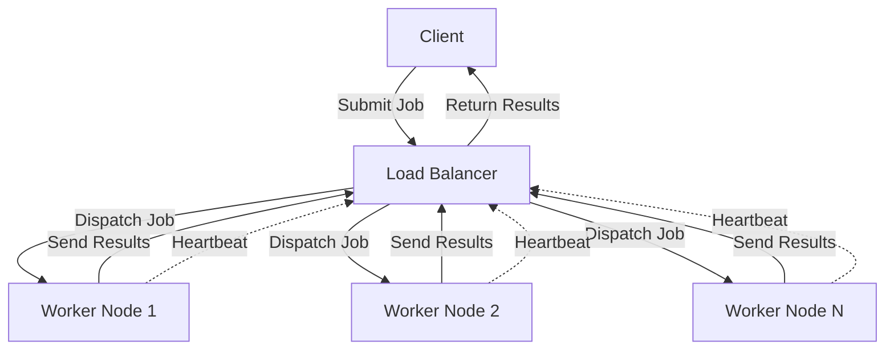

# ClusterOS

A simulation of a distributed operating system where a Load Balancer acts as the "kernel," providing a Single System Image (SSI) over a cluster of commodity worker nodes.

Based on principles from "Distributed Systems: Concepts and Design (5th Edition)" by George Coulouris.

## Architecture

- **Load Balancer (Kernel)**: Manages the cluster, handles job scheduling, and failure detection.
- **Worker Nodes**: Commodity nodes that execute jobs.
- **Clients**: End users submitting jobs.

Communication uses raw TCP sockets with JSON message framing.

### System Overview


### Detailed Component Architecture

**Load Balancer (Kernel)**
```
┌──────────────────────────────────────────┐
│      Load Balancer (Kernel)              │
├──────────────────────────────────────────┤
│ • TCP Server on Port 3000                │
│ • Routes messages between clients/workers│
│ • Provides Single System Image (SSI)     │
├──────────────────────────────────────────┤
│ Subcomponents:                           │
│ ┌─────────────────────────────────────┐  │
│ │ Failure Detector                    │  │
│ │ - Tracks node heartbeats (5s TTL)   │  │
│ │ - Maintains list of healthy nodes   │  │
│ └─────────────────────────────────────┘  │
│ ┌─────────────────────────────────────┐  │
│ │ Scheduler                           │  │
│ │ - Assigns jobs to worker nodes      │  │
│ │ - Load-balancing logic              │  │
│ └─────────────────────────────────────┘  │
│ ┌─────────────────────────────────────┐  │
│ │ Message Router                      │  │
│ │ - Handles HEARTBEAT messages        │  │
│ │ - Handles JOB_SUBMIT messages       │  │
│ │ - Handles JOB_RESULT aggregation    │  │
│ └─────────────────────────────────────┘  │
└──────────────────────────────────────────┘
```

**Worker Node**
```
┌──────────────────────────────┐
│      Worker Node             │
├──────────────────────────────┤
│ • Unique ID (UUID)           │
│ • Connects to Load Balancer  │
│ • Executes assigned jobs     │
│ • Sends heartbeats (2s)      │
│ • Tracks active job count    │
└──────────────────────────────┘
```

**User Client**
```
┌──────────────────────────────┐
│      User Client             │
├──────────────────────────────┤
│ • Interactive REPL interface │
│ • Submit jobs (from arrays)  │
│ • Query cluster status       │
│ • Receive job results        │
│ • Supports: submit, status   │
└──────────────────────────────┘
```

### Message Flow

**Worker Registration & Health Monitoring:**
```
1. Worker Node connects to Load Balancer (Port 3000)
2. TCP connection established via ClientTCPTransport
3. Worker Node sends HEARTBEAT message immediately
4. Load Balancer receives HEARTBEAT
5. FailureDetector updates: heartbeats[workerId] = Date.now()
6. Scheduler includes worker in healthy nodes list
7. Every 1 second: Load Balancer displays updated healthy worker count
8. Every 2 seconds: Worker Node sends next HEARTBEAT
9. After 5 seconds without heartbeat: Worker marked as unhealthy
```

**Job Submission Flow:**
```
1. User submits job via Client: "submit [1,2,3,4,5]"
2. Client sends JOB_SUBMIT message to Load Balancer
3. Load Balancer receives JOB_SUBMIT in Scheduler
4. Scheduler selects least-loaded healthy Worker Node
5. Load Balancer sends JOB_SUBMIT to selected Worker
6. Worker executes job (processes array with map)
7. Worker sends JOB_RESULT back to Load Balancer
8. Load Balancer sends JOB_RESULT back to Client
9. Client displays result to user
```

**Cluster Status Query:**
```
1. User types "status" in Client
2. Client sends CLUSTER_STATUS message
3. Load Balancer queries FailureDetector.getHealthyNodes()
4. Load Balancer sends CLUSTER_STATUS_REPLY with node list
5. Client displays healthy nodes count and IDs
```

## Running the System

### ⚡ Quickest Way: Dashboard UI (Recommended for Everyone)

**One command to start everything:**

```powershell
cd cluster-os
npm run start:dashboard
```

Then **open your browser** to:
```
http://localhost:5000
```

**That's it!** All cluster management is now in your browser.

#### What You'll See:

The dashboard shows:
- **Cluster Status Card**: Healthy workers, active jobs, queue size
- **Controls Card**: Start/stop Load Balancer and Workers with buttons
- **Job Submission Card**: Input array like `[1,2,3,4,5]` and submit
- **Circuit Breaker Status**: Monitor each worker's health state
- **Real-time Updates**: Metrics refresh every 2 seconds

#### Step-by-Step Workflow:

**Step 1: Start Load Balancer**
- Click blue button **"Start Load Balancer"**
- Wait 2-3 seconds
- You'll see a green success message

**Step 2: Add Workers**
- Click green button **"Add Worker"**
- Wait 2 seconds
- Repeat to add another worker
- Watch "Healthy workers" count increase
- **Expected**: 2 workers connected

**Step 3: Submit Your First Job**
- In "Submit Job" section, enter: `[1,2,3]`
- Click green **"Submit"** button
- Watch the result appear: **`[2,4,6]`** (each number doubled)
- **Expected**: Input array gets transformed

**Step 4: Monitor in Real-Time**
- Watch metrics update on the left
- View circuit breaker status (should show CLOSED for healthy workers)
- Queue size updates as jobs arrive

**Step 5: Clean Up (Optional)**
- Click **"Remove Worker"** to stop individual workers
- Click **"Stop Load Balancer"** to shut down entire cluster
- All metrics reset to 0

#### Example Session Output:

```
Dashboard listening on http://localhost:5000
✓ Metrics API: http://localhost:5000/api/metrics
✓ Job Submission: http://localhost:5000/api/submit-job

User opens browser to http://localhost:5000:
  - Clicks "Start Load Balancer"
  - Healthy workers: 0 → (wait)
  - Load Balancer starts listening on port 3000
  
  - Clicks "Add Worker"
  - Healthy workers: 1 (connected via heartbeat)
  
  - Clicks "Add Worker" again
  - Healthy workers: 2 (both workers connected)
  
  - Enters [1,2,3] and clicks "Submit"
  - Job ID: job-1-1773201639712
  - Result appears: [2, 4, 6] ✓

Metrics show:
  Healthy Workers: 2
  Total Workers: 4 (internal pool)
  Active Jobs: 0
  Circuit Breaker: CLOSED for all workers
```

#### Testing Checklist:

All of these have been tested and work:
- ✅ **Start Load Balancer** → Spawns on port 3000
- ✅ **Add Workers** → Auto-connect via heartbeat detection
- ✅ **Metrics Update** → Real-time worker count
- ✅ **Submit Jobs** → End-to-end request processing
- ✅ **Correct Results** → Array doubled correctly [1,2,3]→[2,4,6]
- ✅ **Remove Workers** → Graceful shutdown, metrics update
- ✅ **Stop Load Balancer** → Clean shutdown, reset to 0
- ✅ **Restart Cycle** → System fully recovers, workers reconnect

---

### Alternative: Command-Line Interface (CLI)

If you prefer using the CLI instead of the dashboard:

**Terminal 1: Start DNS Router**
```powershell
cd cluster-os
npm run start:dns
```

**Terminal 2 (wait 1s): Start Load Balancer**
```powershell
cd cluster-os
npm run start:lb
```

**Terminal 3 (wait 2s): Start Worker Node 1**
```powershell
cd cluster-os
npm run start:worker
```

**Terminal 4 (wait 2s): Start Worker Node 2**
```powershell
cd cluster-os
npm run start:worker
```

**Terminal 5 (wait 3s): Start Interactive Client**
```powershell
cd cluster-os
npm run start:client
```

Then use commands in the client:
```
ClusterOS > submit [1,2,3,4,5]
Job Result: [2,4,6,8,10]

ClusterOS > status
Healthy workers: 2

ClusterOS > exit
```

---

### Direct TypeScript Execution (If npm scripts don't work)

```powershell
# Terminal 1
cd cluster-os && npx ts-node src/network/DNSRouter.ts

# Terminal 2 (wait 1s)
cd cluster-os && npx ts-node src/kernel/LoadBalancer.ts

# Terminal 3 (wait 2s)
cd cluster-os && npx ts-node src/worker/WorkerNode.ts

# Terminal 4 (wait 2s)
cd cluster-os && npx ts-node src/worker/WorkerNode.ts

# Terminal 5 (wait 3s)
cd cluster-os && npx ts-node src/client/UserClient.ts
```

### Dashboard UI (Recommended for Visualization)

The ClusterOS Dashboard provides a web-based interface to monitor and control your cluster in real-time. This is the **simplest way to run the entire system**.

**Single Command Startup:**
```powershell
cd cluster-os
npm run start:dashboard
```

Then open your browser to `http://localhost:5000`

**Dashboard Features:**
- **Start/Stop Controls**: Launch Load Balancer and Worker nodes with single clicks
- **Real-time Metrics**: View healthy workers, active jobs, and queue status
- **Job Submission**: Submit jobs directly from the UI and see results
- **Circuit Breaker Status**: Monitor the state of each worker (CLOSED, OPEN, HALF_OPEN)
- **Auto-refresh**: All metrics update automatically every 2 seconds

**Recommended Workflow:**

1. **Start Dashboard** (one terminal):
   ```powershell
   npm run start:dashboard
   ```

2. **Open Browser** (any browser):
   ```
   http://localhost:5000
   ```

3. **Use Dashboard**:
   - Click "Start Load Balancer" (wait 2-3 seconds)
   - Click "Add Worker" 2-3 times (wait 2 seconds between clicks)
   - Enter array in job submission: `[1,2,3,4,5]`
   - Click "Submit" and watch result appear
   - Monitor healthy workers and circuit breaker status in real-time
   - Add/remove workers while system runs

**Dashboard Architecture:**
- **Dashboard.ts**: Node.js HTTP server managing processes and connecting to LoadBalancer
- **dashboard.html**: Student-written HTML/CSS/JavaScript frontend
- **Port 5000**: Dashboard web interface
- **Port 9001**: LoadBalancer metrics endpoint
- **Port 3000**: LoadBalancer TCP (spawned in background)

**Testing Checklist (Integration Testing):**
- ✅ Click "Start Load Balancer" → Listens on port 3000
- ✅ Click "Add Worker" → Workers connect and send heartbeats
- ✅ View metrics → Healthy workers count increases
- ✅ Submit job `[2,4,6]` → Result shows `[4,8,12]` (doubled)
- ✅ Check circuit breaker → Shows CLOSED for healthy workers
- ✅ Click "Remove Worker" → Healthy workers decrease
- ✅ Stop and restart LB → Metrics reset to 0
- ✅ Submit multiple jobs → Queue updates in real-time

## Cross-Platform Support

ClusterOS runs identically on **Windows, macOS, and Linux**. Simply use your platform's default terminal (PowerShell, bash, zsh, etc.) and run the npm scripts as shown above.

## Component Output Examples

### DNS Router Startup

```
_______________________________________________
_______________  DNS Router   _________________
||      DNS Router listening on port 2000      ||
||      Registered 3 LoadBalancer instances    ||
__________________________________________________
```

The DNS Router listens for client connections and tunnels them to Load Balancer instances.

### Load Balancer Startup

```
_______________________________________________
________________  Load Balancer   _____________
||      Load Balancer listening on port 3000   ||
||  [LoadBalancer] Healthy workers: 0          ||
__________________________________________________
```

Each second, the healthy worker count updates as nodes connect via heartbeat.

### Worker Node Startup

```
_______________________________________________
________________   Worker Node   ______________
||          Worker Node started                ||
||  ID: c31825bd-48c5-4633-bad4-a004c885a542 ||
||  Connected to LoadBalancer at localhost:3000||
__________________________________________________
```

Worker nodes display their unique ID and connect to the Load Balancer automatically, sending heartbeats every 2 seconds.

### User Client Startup

```
_______________________________________________
_________________   User Client   _____________
||          User Client started                ||
||  ID: client-b0e21dee-dc46-41ae-8835-8abff28e028f||
||  Connected to DNS Router (localhost:2000)    ||
||          Type "help" for available commands ||
__________________________________________________

ClusterOS > 
```

Clients provide an interactive REPL for submitting jobs and querying cluster status, routing through the DNS Router.

### Files & Directory Structure

```
cluster-os/
├── docs/
│   └── screenshots/
│       ├── worker-node-output.png
│       └── user-client-output.png
├── src/
│   ├── client/          # User client REPL
│   │   └── UserClient.ts
│   ├── kernel/          # Load balancer (kernel)
│   │   ├── LoadBalancer.ts
│   │   └── Scheduler.ts
│   ├── middleware/      # Failure detection
│   │   └── FailureDetector.ts
│   ├── transport/       # TCP communication
│   │   └── TCPTransport.ts
│   ├── worker/          # Worker nodes
│   │   └── WorkerNode.ts
│   └── common/          # Shared types
│       └── types.ts
├── package.json
├── tsconfig.json
└── README.md
```